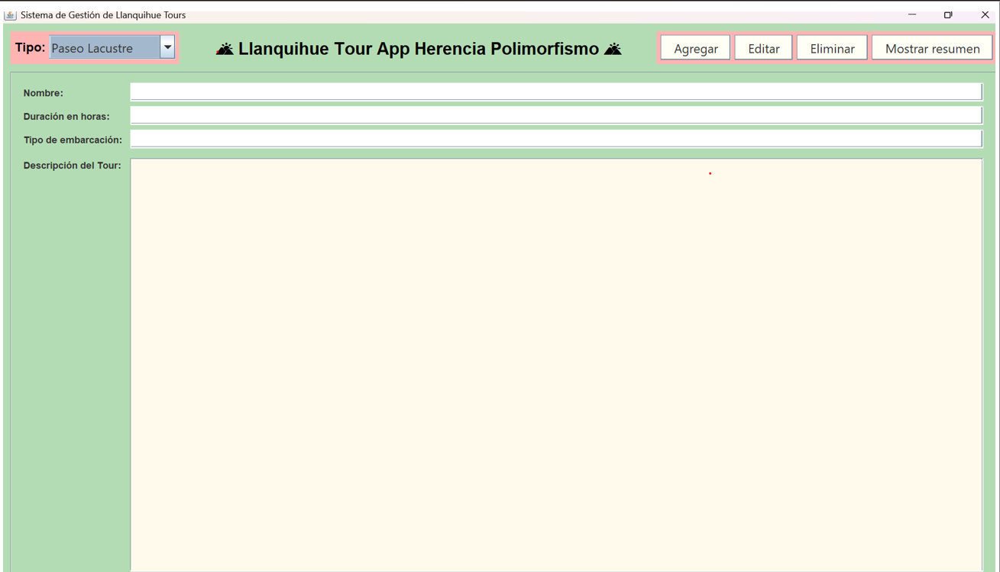
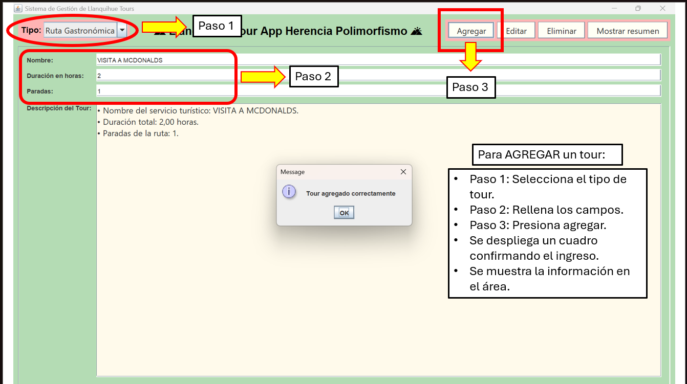
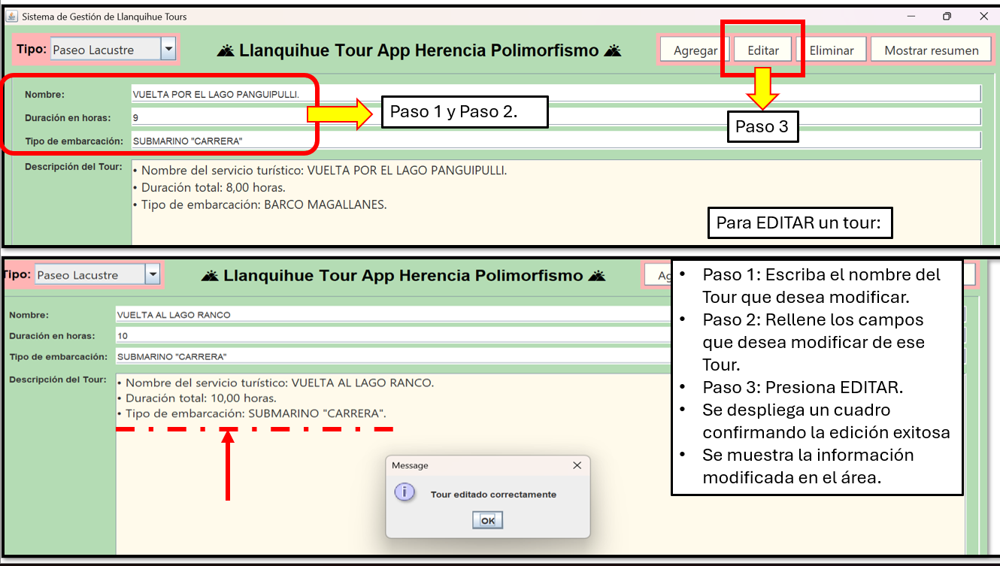
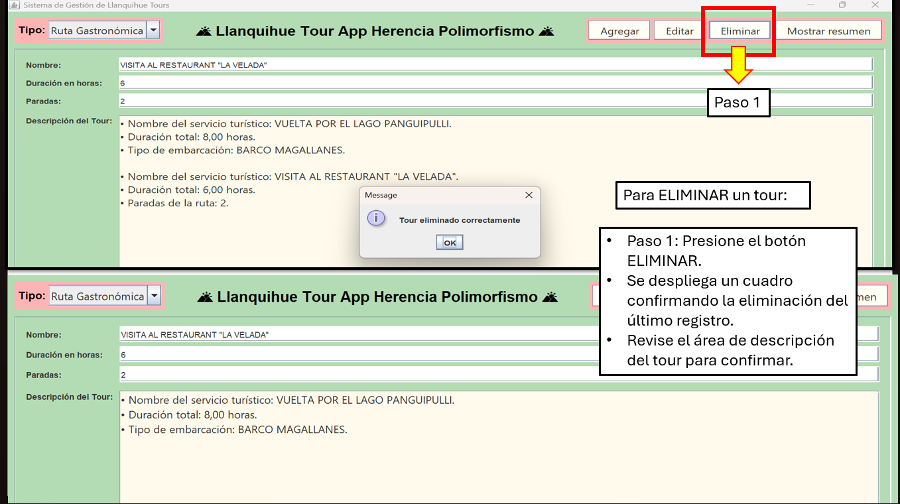
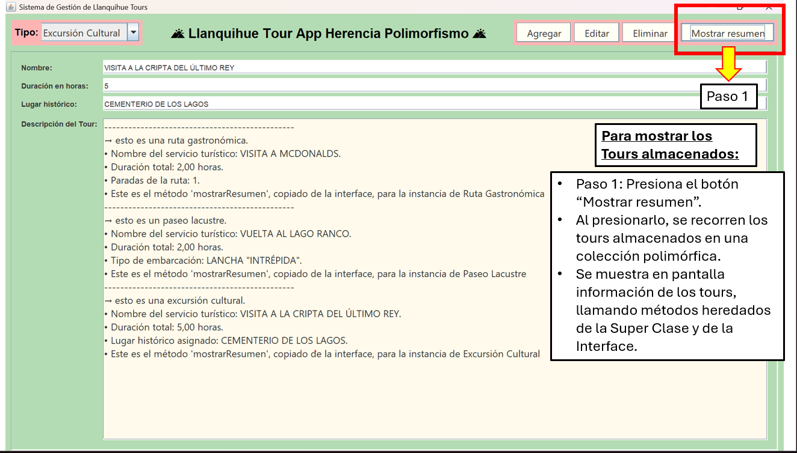

# 🌄Proyecto Llanquihue Tour App Herencia Poli.

## 👤 Información del estudiante
```txt
Nombre del Alumno:   Cristián Fáundez
Carrera:             Analista Programador Computacional
Fecha de entrega:    13 de Julio del 2026
```
## Objetivo del proyecto
- Gestionar de manera eficiente la información de los recorridos turísticos ofrecidos por la agencia "Llanquihue Tours" implementando un sistema de jerarquía de Clases con herencia simple, con la intención de continuar escalando el proyecto conforme a los nuevos requierimientos del cliente. 

 ---
 
## Estructura del proyecto.
- A continuación se muestra una imagen general de la estructura del proyecto:
```md
📁 src/
├──ui/           # Clase principal con el método main
├──model/        # Clases de dominio (Servicio turístico, Ruta gastronómica, Paseo lacustre, Excursión cultural, Registrable y Pantalla)
├──data/         # Clase de Gestión de Servicios (Gestor Servicios)
├──img/          # Carpeta con imágenes del funcionamiento de la GUI.
```
## ⚙️ Funcionamiento general

### 🧩 Interfaz Gráfica de Usuario (GUI).
Es la aplicación de escritorio del sistema de gestión de Llanquihue Tour. Permite ingresar, editar y eliminar los distintos "Tours" ingresados por el operador del software. Además, se puede ver en pantalla un resumen con todos los datos ingresados.

### 📌 Paquete `model`
Contiene las clases base del sistema:

- **ServicioTuristico**: clase genérica que representa un servicio turístico ofrecido por la agencia.
- **RutaGastronomica**: recorrido que incluye restaurantes en cada una de sus paradas.
- **PaseoLacustre**: recorrido por distintos lagos de la región, cada uno con su embarcación característica.
- **ExcursionCultural**: recorrido por lugares históricos y emblemáticos de la región.
- **Registrable**: es una "Interface" que implementa un método compartido por todas las clases. Toda clase que haga uso de ella, debe implementar por obligación su método "mostrarResumen".
- **Pantalla**: clase que contiene la lógica para el funcionamiento interno de la interfaz gráfica de usuario (GUI).

### 📌 Paquete `data`
Incluye la clase **GestorServicios**, responsable de crear automáticamente instancias de cualquiera de los servicios turísticos disponibles. Además, implementa un método llamado "crearServicioAlTurista", para almacenar colecciones polimórficas.

### 📌 Paquete `ui`
Contiene la clase **Main**, encargada de ejecutar la aplicación, integrar los componentes y mostrar la información por consola.
Además, se ha añadido una funcionalidad que permite ejecutar la aplicación con una interfaz gráfica.

### 📌 Paquete `img`
Contiene las imágenes que explican el funcionamiento de la interfaz gráfica de usuario (GUI).

---
## 🛠️ Ejemplo de uso de la interfaz gráfica de usuario (GUI)

```md


```

## 🛠️ Ejemplo para agregar nuevos tours a una colección:

```md

```

## 🛠️ Ejemplo para editar tours de la colección:

```md

```

## 🛠️ Ejemplo para eliminar último tour de una colección:

```md

```

## 🛠️ Ejemplo para mostrar resumen de los tours de una colección:

```md

```

## Instrucciones para ejecutar el proyecto
1. Clona el repositorio desde GitHub:
https://github.com/Cris-faena/LlanquihueTourAppHerenciaPoli.git
3. Abre el proyecto en "IntelliJ IDEA".
4. Ejecuta el archivo Main.Java. desde el paquete "ui".
5. Sigue las instrucciones en consola o la interfaz gráfica.
